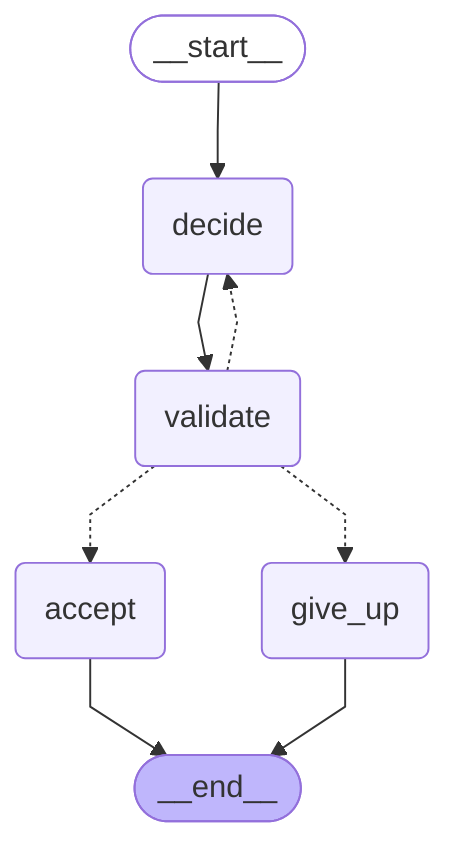

# Lesson 1 の工程表

`npm run l1` で自動生成。

```mermaid
%%{init: {'flowchart': {'curve': 'linear'}}}%%
graph TD;
	__start__([<p>__start__</p>]):::first
	decide(decide)
	validate(validate)
	accept(accept)
	give_up(give_up)
	__end__([<p>__end__</p>]):::last
	__start__ --> decide;
	accept --> __end__;
	decide --> validate;
	give_up --> __end__;
	validate -.-> decide;
	validate -.-> accept;
	validate -.-> give_up;
	classDef default fill:#f2f0ff,line-height:1.2;
	classDef first fill-opacity:0;
	classDef last fill:#bfb6fc;

```
